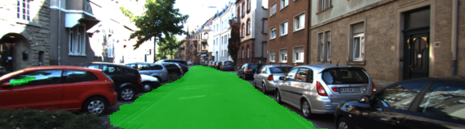

# Semantic Segmentation

### Introduction
In this project, we'll label the pixels of a road in images using a Fully Convolutional Network (FCN). In particular we will implement the [FCN-8 architecture](https://arxiv.org/pdf/1605.06211.pdf). The ground truth for this dataset comes from the Kitti Road Detection dataset. 

### Setup 

For instructions on setup please refer to this [link](https://github.com/udacity/CarND-Semantic-Segmentation). 

### How to run

To run the training and inference use this script. This does require a good GPU for faster runs.

``` python main.py ```

### Model Architecture

The FCN-8 model architecture is made up of 2 parts as seen below


An image encoder and an image decoder network. To be able to build convolutional encoder decoder networks from scratch takes a lot of training examples. In this case we can reduce the time it takes to train such networks and get away with a lot less training examples by using a pre-trained conv-net for the encoder. In this project we will load the popular [VGG-16](https://www.google.com/url?sa=t&rct=j&q=&esrc=s&source=web&cd=3&cad=rja&uact=8&ved=0ahUKEwiXt4Kiw_DWAhVlzIMKHX3WBckQFgg1MAI&url=https%3A%2F%2Farxiv.org%2Fabs%2F1409.1556&usg=AOvVaw17ak86ejVzNlyA2N-WpWmZ) model from research.

The FCN8 decoder simply requires projecting layers from the encoder using 1x1 convolutions and adding skip connections from intermediate layers to the output. Thus the final resulting image has the same number of channels as the target segmentation image, which in this case is 2, 1 channel for the label "road" and 1 channel for the label "not road".

### Results

Here are some good results from the segmentation


Here are some cases where the segmentation results need improvement

In this result image there is a small section of the road in the middle which was not labeled as "road"


here's an example where the window of a vehicle is labled "road"


### Conclusion

Overall, the semantic segmentation results are very good and the FCN-8 encoder decoder architecture implementation and training for this project is a success.

### Future scope for improvement

Image Augmentation can be used to ensure that the network sees more samples. The types of augmentation that can be applied are flipping of the image vertically and horizontally, darkening/brightening of the images, zoom and crop. Zoom and crop may be a little involved since the ground truth will also need zooming and cropping to stay in sync. However flipping and brightness changes should be relatively straightforward to implement for this project in the ```get_batches_fn```.

Finally a newer architecture called [Tiramisu](https://arxiv.org/abs/1611.09326) networks show a lot of promise in achieving fast and more accurate semantic segmentation while at the same time requiring a lot fewer weights to train and store for inference. This is certainly a network architecture worth exploring.
